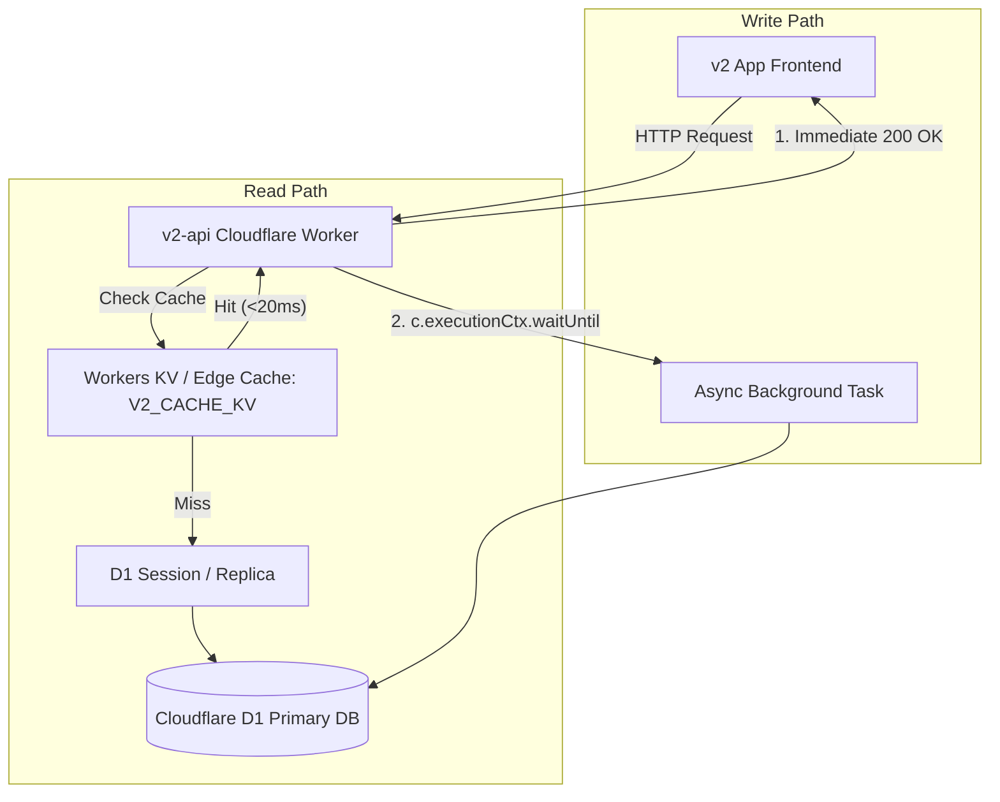

# Implementation Plan - v2 App Cloudflare D1 & Network Latency Optimization

This document outlines the technical strategy and execution steps for mitigating database latency and cross-border network instability between Mainland China edge nodes and Cloudflare D1.

To ensure stability and prevent regressions, implementation is broken down into **micro-phases**. Each phase targets a single, isolated change that is deployed, tested, and verified independently.

---

## Technical Architecture Overview

---

## Progress & Status Tracker

| Phase | Description | Status | Details / Outcome |
|---|---|---|---|
| **Phase 1** | Async Non-Blocking Submissions | ✅ **Completed & Deployed** | `POST /api/records` now uses `c.executionCtx.waitUntil` for instant response times. |
| **Phase 2** | Non-Blocking & Debounced Mistakes Sync | ✅ **Completed & Deployed** | Frontend debounces `syncToServer` (400ms); `PUT /api/mistakes` uses `c.executionCtx.waitUntil`. |
| **Phase 3** | Cloudflare KV Binding Setup | ✅ **Completed & Deployed** | `V2_CACHE_KV` namespace created (`2ddc89e40f194e8b8b7c8d7a8830add8`) & bound in `wrangler.jsonc`. |
| **Phase 4** | Edge Caching for Practice Catalog | ✅ **Completed & Deployed** | `GET /api/practices` serves read-through edge cache via `V2_CACHE_KV` (10-min TTL). |
| **Phase 5** | D1 Session & Multi-Read Batching | ⏳ **Planned** | Optimize remaining sequential read queries with `env.DB.batch(...)` and D1 session hints. |

---

## Micro-Phases & Execution Steps

### Phase 1: Non-Blocking Async Practice Submissions (✅ Done)
**Goal:** Make practice result submissions instant for the user by moving D1 insertion to a background task (`c.executionCtx.waitUntil`).

- **Status:** ✅ Deployed to Production.
- **Changes:**
  - Modified `POST /api/records` in `v2-api/src/index.ts`.
  - Moved `db.insert(practiceRecords)` to `c.executionCtx.waitUntil(...)`.

---

### Phase 2: Non-Blocking & Debounced Mistakes Sync (✅ Done)
**Goal:** Prevent request bursts and UI hangs during mistake updates and question deletions.

- **Status:** ✅ Deployed to Production.
- **Changes:**
  - **Frontend:** Removed redundant `syncToServer` calls in `Dashboard.tsx` and added 400ms debounce in `mistakeService.ts`.
  - **Backend:** Converted `PUT /api/mistakes` D1 user updates in `v2-api/src/index.ts` to `c.executionCtx.waitUntil(...)`.

---

### Phase 3: Cloudflare KV Binding Setup (✅ Done)
**Goal:** Bind KV namespace to the worker for edge caching.

- **Status:** ✅ Deployed to Production.
- **Changes:**
  - Created Cloudflare KV namespace `V2_CACHE_KV` (`2ddc89e40f194e8b8b7c8d7a8830add8`).
  - Added KV binding to `v2-api/wrangler.jsonc` and worker `Bindings` type in `index.ts`.

---

### Phase 4: Edge Caching for Read-Heavy Practice Catalog (✅ Done)
**Goal:** Cache static/semi-static practice lists in KV to bypass D1 reads for standard users.

- **Status:** ✅ Deployed to Production.
- **Changes:**
  - On `GET /api/practices`, check `c.env.V2_CACHE_KV` first.
  - On cache miss, query D1 and populate `V2_CACHE_KV` with 10-minute expiration TTL via background `waitUntil`.

---

### Phase 5: D1 Session / Multi-Read Batching (⏳ Next)
**Goal:** Enable D1 read replicas and batch remaining sequential read queries.

- **Scope:** Database multi-read endpoints in `v2-api/src/index.ts`.
- **Changes:**
  - Wrap sequential read queries in `env.DB.batch(...)`.
  - Apply `env.DB.withSession(...)` where applicable.

---

## Verification & Rollback Strategy

1. **Phase-by-Phase Testing:** Each phase is verified independently before deployment.
2. **Zero Schema Mutations:** None of these phases alter the database schema or Drizzle models, eliminating data migration risk.
3. **Instant Rollback:** Endpoints maintain complete fallback capabilities if KV is unpopulated or missing.
